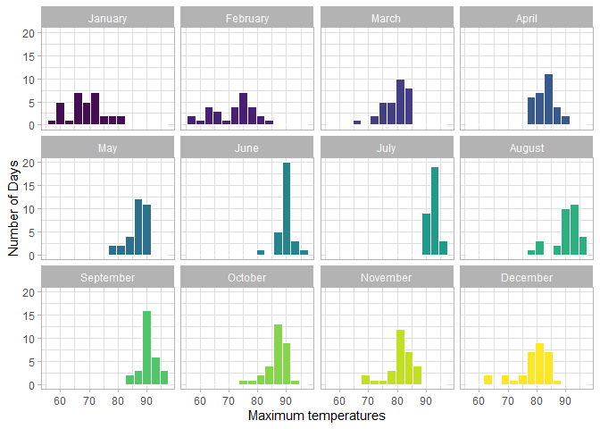
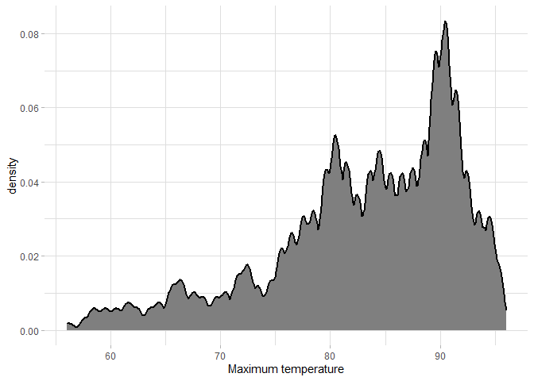
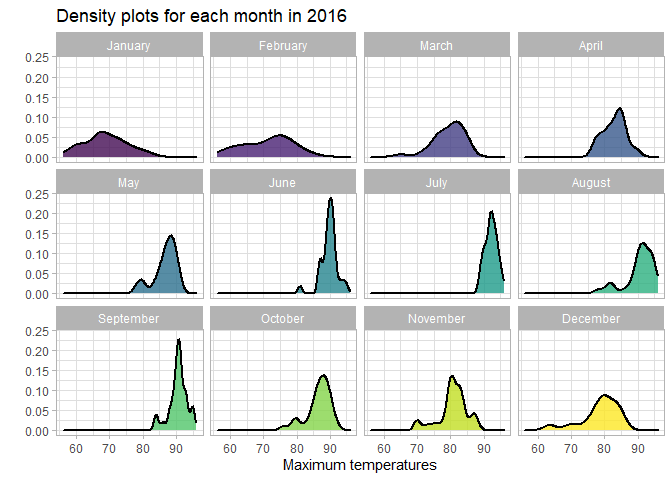
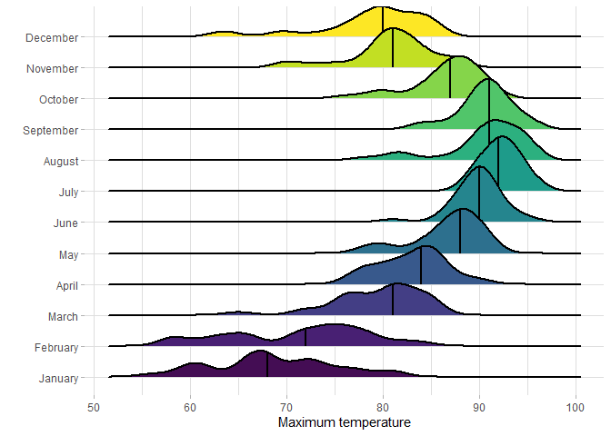
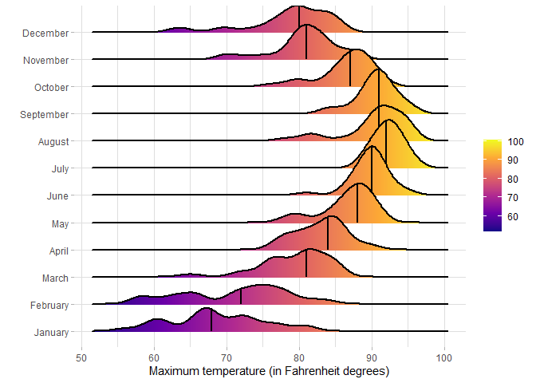
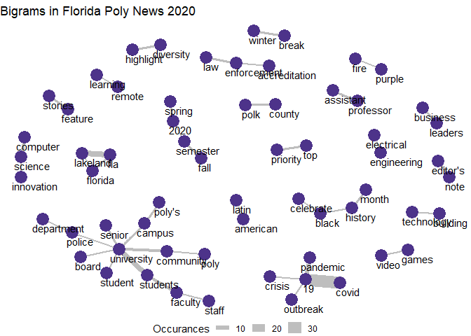

# Data Visualization Project 03


In this exercise you will explore methods to visualize text data and practice how to recreate charts that show the distributions of a continuous variable. 


## Part 1: Density Plots

Using the dataset obtained from FSU's [Florida Climate Center](https://climatecenter.fsu.edu/climate-data-access-tools/downloadable-data), for a station at Tampa International Airport (TPA) from 2016 to 2017, attempt to recreate the charts shown below


```r
library(tidyverse)
library(RColorBrewer)
library(ggridges)
library(tidytext)
library(igraph)
library(ggraph)
weather_tpa <- read_csv("https://github.com/reisanar/datasets/raw/master/tpa_weather_16_17.csv")
# random sample 
sample_n(weather_tpa, 4)
```

```
## # A tibble: 4 x 6
##    year month   day precipitation max_temp min_temp
##   <dbl> <dbl> <dbl>         <dbl>    <dbl>    <dbl>
## 1  2016     6    23             0       91       79
## 2  2016     1    20             0       66       41
## 3  2016    11    27             0       80       57
## 4  2016     6    21             0       89       66
```

```r
color_scale = c("#440D54","#482073","#433E85","#38598C","#2D708E","#25858E","#1E9B8A","#2CB07F","#51C56A","#85D54A","#C2DF23","#FDE725")
```

(a)



(b)



(c)



(d)



(e)


(f) 




## Part 2: Visualizing Text Data

The visualization below shows the various combinations of words in the Florida Poly News 2020 file, with edge node being a word and the edges being times the words were used together as a bigram. The size of the edge shows the frequencies. "Covid 19" is the most common bigram as we would expect for any news source in 2020.

<!-- -->

